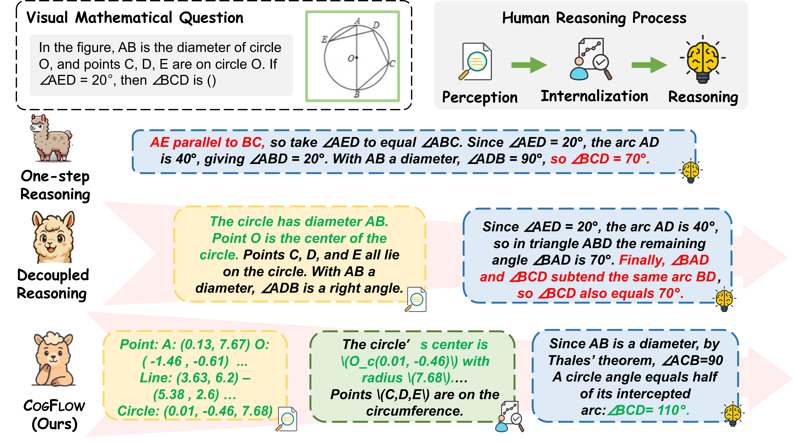

# CogFlow

<b>CogFlow: Bridging Perception and Reasoning through Knowledge Internalization for Visual Mathematical Problem Solving</b> <br/>
[Shuhang Chen](https://scholar.google.com/citations?user=tt0czd0AAAAJ&hl=zh-CN),[Yunqiu Xu](https://scholar.google.com/citations?user=SdJX4nAAAAAJ&hl=zh-CN),Junjie Xie, Aojun Lu,Tao Feng,    Zeying Huang, Ning Zhang, Yi Sun,  [Yi Yang](https://scholar.google.com/citations?user=RMSuNFwAAAAJ&hl=en) and [Hangjie Yuan](https://scholar.google.com/citations?user=jQ3bFDMAAAAJ&hl=en) <br/>
ICLR 2026 <br/>

[paper](https://arxiv.org/pdf/2601.01874) | [code](https://github.com/ShChen233/cogflow_code)


## 👀 About CogFlow
Despite recent advances, multimodal large language models continue to struggle with visual mathematical problem solving. Some recent works recognize that visual perception is a bottleneck in visual mathematical reasoning, but their solutions are limited to improving the extraction and interpretation of visual inputs. Notably, they all ignore the key issue of whether the extracted visual cues are faithfully integrated and properly utilized in subsequent reasoning. Motivated by this, we present CogFlow, a novel cognitive-inspired three-stage framework that incorporates a knowledge internalization stage, explicitly simulating the hierarchical flow of human reasoning: perception ⇒ internalization ⇒ reasoning. In line with this hierarchical flow, we holistically enhance all its stages. We devise synergistic visual rewards to boost perception capabilities in parametric and semantic spaces, jointly improving visual information extraction from symbols and diagrams. To guarantee faithful integration of extracted visual cues into subsequent reasoning, we introduce a visual-anchored reward model in the internalization stage, bridging perception and reasoning. Moreover, we design a visual-gated policy optimization algorithm to further enforce the reasoning is grounded with the visual knowledge, preventing models seeking shortcuts that appear coherent but are visually ungrounded reasoning chains. Moreover, we contribute a new dataset MathCog for model training, which contains samples with over 120K high-quality perception-reasoning aligned annotations. Comprehensive experiments and analysis on three commonly used visual mathematical reasoning benchmarks validate the superiority of the proposed CogFlow.



## 1. Repository Structure

The structure below matches the current repository layout:

```
├── .vscode/
├── data/ # Data directory (train/val/infer)
├── docker/ # Docker environments
├── docs/ # Documentation
├── outputs/ # Training / inference outputs (logs, ckpts, jsonl)
├── recipe/ # Training recipe configs (if any)
├── reward/
│ └── vgpo_reward.py # ✅ Custom reward function for VERL training
├── scripts/ # Helper scripts (optional)
├── src/
│ ├── cogflow_process_data.py # ✅ Data preprocessing script
│ ├── infer.py # ✅ Inference entry (with VSR gating)
│ ├── infer.sh # ✅ Inference launch script
│ └── train_vgpo.sh # ✅ VGPO training launch script
├── tests/
├── verl/ # ✅ VERL source code (your local rollout modifications are here)
├── verl.egg-info/
├── pyproject.toml
├── requirements.txt
├── requirements_sglang.txt
├── requirements-npu.txt
├── setup.py
├──evaluation/ ✅ To evaluate CogFlow on FlowVerse, MathVerse and other benchmark
│ ├── build_query.py
│ ├── extract_answer_s1.py
│ ├── extract_answer.sh
│ ├── generate_response.sh
│ ├── generate_response.py
│ ├── score_answer_s2.py
│ ├── score_answer_s2.sh
│ ├── score_final.py
│ ├── score_final.sh
│ └── prompt.py
├──evaluation_models/
│ ├── CogFlow.py
│ └── gpt.py
└── README.md
```


---

## 2. Environment & Installation

### 2.1 Python & CUDA

Recommended:
- Python >= 3.10
- CUDA >= 11.8 (depends on your torch/vLLM versions)
- Multi-GPU training: 8 GPUs (adjustable)

### 2.2 Install Dependencies

Install base dependencies:

```bash
pip install -r requirements.txt
```

# 3. Data Preparation

Preprocessing script:
```bash
src/cogflow_process_data.py
```


Example usage:
```bash
python src/cogflow_process_data.py \
  --input data/raw \
  --output data/processed
```

## 3.1 Training Data Format (VERL)

Training uses parquet by default:

- data/train.parquet

- data/val.parquet

Inference often uses jsonl (or any custom format):

- data/infer.jsonl

# 4. RL Training (VGPO / PPO-like)

Training entry script:
```bash

bash src/train_vgpo.sh
```


# 5. Custom Reward

Custom reward file:

```bash
reward/vgpo_reward.py
```

It is passed to training via:

`custom_reward_function.path=reward/vgpo_reward.py`

`custom_reward_function.name=compute_score
`

Inside `compute_score()` you can implement:

- rule-based reward

- model-based reward (e.g., scoring with IntlzR reward model)

- tool-based reward (e.g., sandbox test cases)

# 6. Visual-Gated Inference

Inference entry points:

`src/infer.py`

`src/infer.sh`


# 7. Run Inference

Run:
```bash
bash src/infer.sh
```

Outputs are saved to:
```bash
outputs/infer/<experiment_name>/*.jsonl
```

# 9. Swift Training (SFT + IntlzR Reward Model)

⚠️ Important: SFT and IntlzR Reward Model are trained using the Swift framework, NOT inside this repository.

This repo is responsible for:

- loading Swift-exported checkpoints as MODEL_DIR

- optionally calling the Swift-trained reward model during reward computation or inference scoring

Artifacts usage:

- SFT checkpoint: used as actor_rollout_ref.model.path=$MODEL_DIR

- IntlzR reward model: can be invoked inside reward/vgpo_reward.py or src/infer.py

# 10. Evaluation on Benchmark


We provide the code to reproduce the results reported in our paper on the FlowVerse, MathVerse, and other benchmark datasets. The evaluation pipeline relies on advanced large language models (e.g., [ChatGPT/GPT-4](https://platform.openai.com/account/api-keys))  to extract and match model answers. Below, we use the evaluation of the FlowVerse dataset as an example.

There are two steps for the evaluation of 'Acc' scores and 'CoT-E' scores of FlowVerse:
#### Step1: Answer Obtain
```bash
cd evaluation 
python generate_response.py \
--data_dir PATH_TO_DATA_DIR \
--input_file PATH_TO_INPUT_FILE \
--output_dir PATH_TO_OUTPUT_DIR \
--output_file PATH_TO_OUTPUT_FILE \
--mode MODE_OF_FLOWVERSE \
--img_dir PATH_TO_IMG_DIR \
```

#### Step2: Answer Extraction
```bash
python extract_answer_s1.py \
--model_output_file PATH_TO_OUTPUT_FILE \
--output_file PATH_TO_GENERATED_FILE \
--mode MODE_OF_FLOWVERSE \
--save_file PATH_TO_ENTRACTION_FILE \
```


#### Step3: Answer Scoring

```bash
python score_answer_s2.py \
--save_file PATH_TO_SCORE_FILE \
--mode MODE_OF_FLOWVERSE \
--output_dir PATH_TO_OUTPUT_DIR \
--output_file PATH_TO_SCORE_FILE \
--trunk_response 30 \
--save_every 10 \
```
#### Step4: Answer Statistics

```bash
python score_final.py \
--data_dir PATH_TO_DATA_DIR \
--input_file PATH_TO_INPUT_FILE \
--save_file PATH_TO_SCORE_FILE \
--mode MODE_OF_FLOWVERSE 
```


# License
```bash 
This project contains ByteDance VERL code and follows the Apache 2.0 License.
```

# Citation 
```bibtex
@article{chen2026cogflow,
  title   = {CogFlow: Bridging Perception and Reasoning through Knowledge Internalization for Visual Mathematical Problem Solving},
  author  = {Chen, Shuhang and Xu, Yunqiu and Xie, Junjie and Lu, Aojun and Feng, Tao and Huang, Zeying and Zhang, Ning and Sun, Yi and Yang, Yi and Yuan, Hangjie},
  journal = {arXiv preprint arXiv:2601.01874},
  year    = {2026}
}